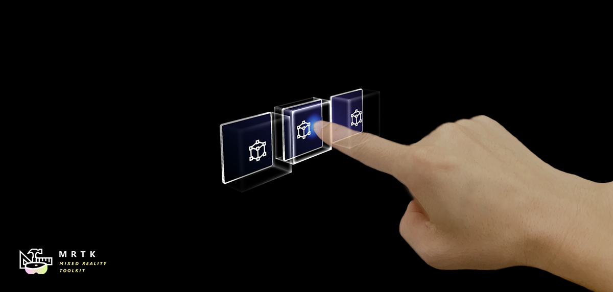
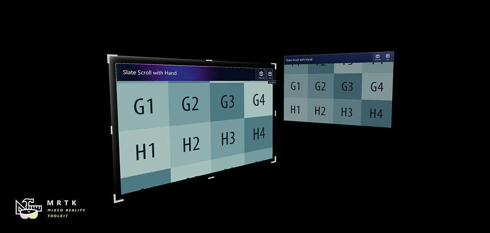
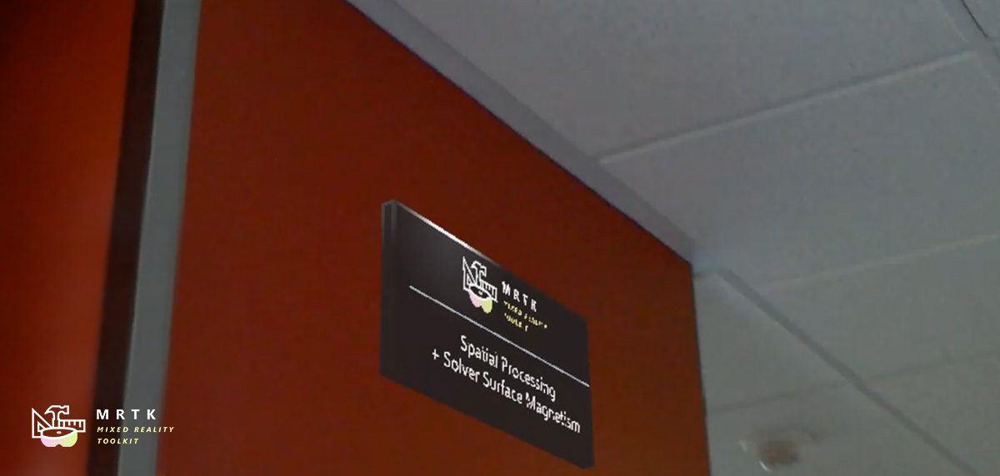
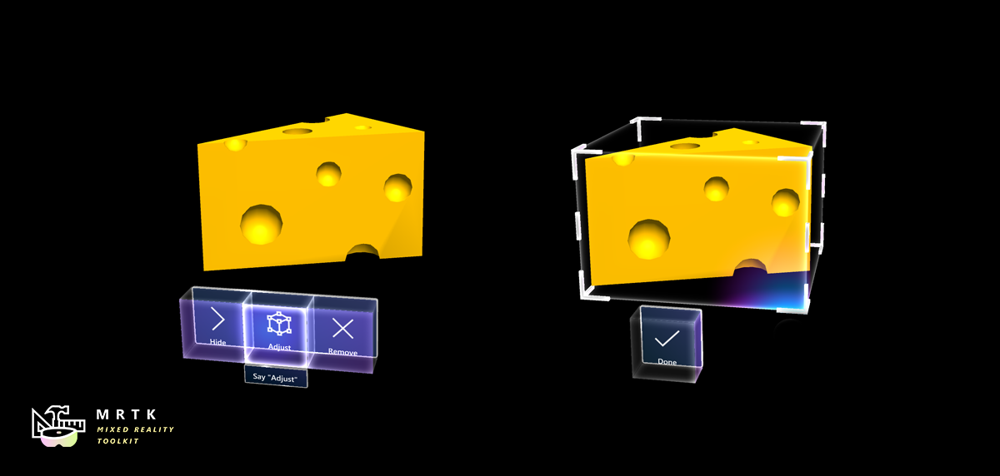

# Mixed Reality Toolkit for WebXR
This repository is a fork of Microsoft [MRTK](https://microsoft.github.io/MixedRealityToolkit-Unity). It adds to the MRTK the WebXR target allowing to do augmented reality in the web browser. This project is a proof of concept and not an industrial implementation ! I developed this demonstration over a long weekend in confinement.


# Demo
Live demo (please use [WebXR Viewer browser](https://apps.apple.com/us/app/webxr-viewer/id1295998056) app on iOS) : https://rufus31415.github.io/sandbox/webxr-hand-interaction/

Video YouTube: https://www.youtube.com/watch?v=msORgnO6R9U&cc_load_policy=1

Hacker News post: 


| | | |
|:-------------------------:|:-------------------------:|:-------------------------:|
| |  ||
|  |  ||


# What is the Mixed Reality Toolkit ?

MRTK-Unity is a Microsoft-driven project that provides a set of components and features, used to accelerate cross-platform MR app development in Unity. Here are some of its functions:

* Provides the **basic building blocks for Unity development on HoloLens, Windows Mixed Reality, and OpenVR**.
* Enables **rapid prototyping** via in-editor simulation that allows you to see changes immediately.
* Operates as an **extensible framework** that provides developers the ability to swap out core components.
* **Supports a wide range of platforms**, including
  * Microsoft HoloLens
  * Microsoft HoloLens 2
  * Windows Mixed Reality headsets
  * OpenVR headsets (HTC Vive / Oculus Rift)
[read more...](https://microsoft.github.io/MixedRealityToolkit-Unity/)


# What is WebXR ?

The WebXR Device API provides access to input and output capabilities commonly associated with Virtual Reality (VR) and Augmented Reality (AR) devices. It allows you develop and host VR and AR experiences on the web. Today (May 2020), few browsers are currently WebXR compatible. [read more...](https://github.com/immersive-web/webxr/blob/master/explainer.md)


# What is Unity ?
[Unity](https://unity.com) is a 3D rendering engine and development environment to create video games, but also 3D experiences of augmented or virtual reality. It provides applications for Windows, MacOS, Linux, Playstation, Xbox, Hololens, WebGL...

WebGL is here the export format used.


# What is WebGL ?
WebGL allows to dynamically display, create and manage complex 3D graphical elements in a client's web browser. Most desktop and mobile browsers are now compatible with WebGL.


# How do you mix all these technologies?

MRTK is developed in Unity. I used here the example scene [Hand Interaction](https://microsoft.github.io/MixedRealityToolkit-Unity/Documentation/README_HandInteractionExamples.html). I compiled it into WebGL with Unity, so I got javascript (as [WebAssembly](https://developer.mozilla.org/fr/docs/WebAssembly)).
Since Safari is not yet compatible with WebXR under iOS (I don't have an Android phone), I had to use the [XRViewer browser](https://apps.apple.com/us/app/webxr-viewer/id1295998056) developed by Mozilla. However, the implementation of WebXR is not standard because it was a test application. ([read more about XRViewer app...](https://github.com/mozilla-mobile/webxr-ios).
I was inspired by the [examples provided by Mozilla](https://ios-viewer.webxrexperiments.com/). I added the generated WebGL component on top of it. I use the WebXR javascript API to transmit the position of the smartphone to the Unity Main Camera.

Moreover, according to the Mozilla examples, I use [Three.js](https://threejs.org/) to display the world mapping mesh (in green).

# Touch screen

A new Input System Profile has been created to support multitouch as well as the mouse pointer. See [MyMixedRealityInputSystemProfile.asset](https://github.com/Rufus31415/MixedRealityToolkit-Unity-WebXR/blob/mrtk_webxr_prototype/Assets/MRTK/SDK/Profiles/HoloLens2/MyMixedRealityInputSystemProfile.asset) and [MyMixedRealityHandTrackingProfile.asset](https://github.com/Rufus31415/MixedRealityToolkit-Unity-WebXR/blob/mrtk_webxr_prototype/Assets/MRTK/SDK/Profiles/HoloLens2/MyMixedRealityHandTrackingProfile.asset).


# WebGL canvas transparent background

The WebGL canvas is placed on top of the video canvas. The black background normally generated by Unity must be made transparent in order to view the video behind the holograms.

For this, a new [Camera Profile](https://github.com/Rufus31415/MixedRealityToolkit-Unity-WebXR/blob/mrtk_webxr_prototype/Assets/MixedRealityToolkit.Generated/CustomProfiles/MyMixedRealityCameraProfile.asset) has been created with a solid color (black background) and 100% transparency.

In addition, a [jslib plugin](https://github.com/Rufus31415/MixedRealityToolkit-Unity-WebXR/blob/mrtk_webxr_prototype/Assets/WebXR/TransparentBackground.jslib) has been written to apply this transparency which is not supported by default in WebGL.
``` javascript
var LibraryGLClear = {
	glClear: function(mask) {
		if (mask == 0x00004000) {
			var v = GLctx.getParameter(GLctx.COLOR_WRITEMASK);
			if (!v[0] && !v[1] && !v[2] && v[3]) return;
		}
		GLctx.clear(mask);
	}
};
mergeInto(LibraryManager.library, LibraryGLClear);
```

Finally, after generation, the ```Build/build.json``` file must be modified to replace ```"backgroundColor": "#000000"``` by ```"backgroundColor": "transparent"```. This operation could be done automatically in post-build.


# HTML
A [WebGL export template](https://github.com/Rufus31415/MixedRealityToolkit-Unity-WebXR/tree/mrtk_webxr_prototype/Assets/WebGLTemplates/WebXR) is used to generate the web page to get the final application. This template was inspired by the [World Sensing](https://github.com/mozilla/webxr-polyfill/blob/master/examples/sensing/index.html) example from Mozilla. It manages the display of the video, the start of the WebXR session and the display in green of the mesh from the world scanning. I added on the video the WebGL canvas generated by Unity.


# Communication between WebXR and Unity

The position of the smartphone is in a Camera Three.js object. It is recovered in loop and transmitted to the Unity camera with the following code:

[Index.html](https://github.com/Rufus31415/MixedRealityToolkit-Unity-WebXR/blob/06d50cbc4fc72e8bfead6bf00bd19511868e2c94/Assets/WebGLTemplates/WebXR/index.html#L61) :
``` javascript
var pose = new THREE.Vector3();
var quaternion = new THREE.Quaternion();
var scale = new THREE.Vector3();

engine.camera.matrix.decompose(pose, quaternion, scale);

var coef = 1/0.4; // Three.js to Unity length scale
var msg = {x: pose.x * coef, y: pose.y * coef, z: -pose.z * coef, _x: quaternion._x, _y: quaternion._y, _z: quaternion._z, _w: quaternion._w, crx: -1, cry: -1, crz: 1, fov:40};
var msgStr = JSON.stringify(msg);

unityInstance.SendMessage("JSConnector", "setCameraTransform", msgStr); // send message to Unity (only 1 argument possible)
```


[JSConnector.cs](https://github.com/Rufus31415/MixedRealityToolkit-Unity-WebXR/blob/mrtk_webxr_prototype/Assets/WebXR/JSConnector.cs) :
``` cs
public void setCameraTransform(string msgStr) {
	var msg = JsonUtility.FromJson<JSCameraTransformMessage>(msgStr);

	Camera.main.transform.position = new Vector3(msg.x, msg.y, msg.z);

	var quat = new Quaternion(msg._x, msg._y, msg._z, msg._w);
	var euler = quat.eulerAngles;

	Camera.main.transform.rotation = Quaternion.Euler(msg.crx * euler.x, msg.cry * euler.y, msg.crz * euler.z);

	Camera.main.fieldOfView = msg.fov;
}
```

Some settings, such as scale change and FOV are hard written and adapted to my iPhone 7 for this POC. 

To be more efficient, the access to the WebXR API should be done in a jslib plugin so that the code is integrated to the WebGL build, this would avoid the heaviness of Three.js, the lags of the "sendMessage" function, and the decoding/encoding of json in string. Also, it would be necessary to think about how to transmit the good parameters of FOV and scaling to Unity. The current code is clearly inefficient, but it is a quick working proof of concept.


# Compilation

WebGL compilation is performed by Unity using the [IL2CPP](https://docs.unity3d.com/Manual/IL2CPP.html) scripting backend then the [Emscripten](https://emscripten.org) WebAssembly compiler.
Note that the [ARSessionOrigin.cs](https://github.com/Rufus31415/MixedRealityToolkit-Unity-WebXR/blob/mrtk_webxr_prototype/Library/PackageCache/com.unity.xr.arfoundation%401.5.0-preview.6/Runtime/AR/ARSessionOrigin.cs) file in the AR Foundation package was voluntarily committed because it includes modifications to be compilable in WebGL.

As mentioned above, after compilation, the Builb/build.json file must be modified for supporting transparency.

Finally, to avoid warnings at runtime about browser incompatibility, the code generated in ```UnityLoader.js``` should be modified by replacing: ```UnityLoader.SystemInfo.mobile``` by ```false``` and ```["Edge", "Firefox", "Chrome", "Safari"].indexOf(UnityLoader.SystemInfo.browser)==-1``` by ```false```.


# Browser compatibility

To date (May 2020), the [XRViewer application](https://apps.apple.com/us/app/webxr-viewer/id1295998056) is the only browser that offers a WebXR implementation on iOS (Safari is not yet compatible). But this implementation is a draft as explained [here](https://github.com/mozilla-mobile/webxr-ios#warning-experimental-exploration-of-the-future-of-webxr). It would not be complicated to make this example compatible with Chrome for Android, or Chrome or Firefox for desktop. This would allow to generate Unity scenes compatible with Android and virtual reality devices like WMR, Oculus, OpenVR, or Vive. Maybe I'll work on it if needed 😀.

If you are using a browser other than XRViewer, you will get an error popup indicating that WebXR is not supported. But you can then enjoy the WebGL scene with the mouse.


With another browser :


With XRViewer :


***


# Original MRTK README :


# Getting started with MRTK

| [](https://microsoft.github.io/MixedRealityToolkit-Unity/Documentation/GettingStartedWithTheMRTK.html)<br/>[Getting Started](https://microsoft.github.io/MixedRealityToolkit-Unity/Documentation/GettingStartedWithTheMRTK.html)| [](https://microsoft.github.io/MixedRealityToolkit-Unity/Documentation/Architecture/Overview.html)<br/>[MRTK Overview](https://microsoft.github.io/MixedRealityToolkit-Unity/Documentation/Architecture/Overview.html)| [](https://microsoft.github.io/MixedRealityToolkit-Unity/Documentation/README_Button.html)<br/>[Feature Guides](https://microsoft.github.io/MixedRealityToolkit-Unity/Documentation/README_Button.html)| [](https://microsoft.github.io/MixedRealityToolkit-Unity/api/Microsoft.MixedReality.Toolkit.html)<br/>[API Reference](https://microsoft.github.io/MixedRealityToolkit-Unity/api/Microsoft.MixedReality.Toolkit.html)|
|:---|:---|:---|:---|

# Build status

| Branch | CI Status | Docs Status |
|---|---|---|
| `mrtk_development` |[](https://dev.azure.com/aipmr/MixedRealityToolkit-Unity-CI/_build/latest?definitionId=15)|[](https://dev.azure.com/aipmr/MixedRealityToolkit-Unity-CI/_build/latest?definitionId=7)

# Required software

 | [](https://developer.microsoft.com/windows/downloads/windows-10-sdk) [Windows SDK 18362+](https://developer.microsoft.com/windows/downloads/windows-10-sdk)| [](https://unity3d.com/get-unity/download/archive) [Unity 2018.4.x](https://unity3d.com/get-unity/download/archive)| [](http://dev.windows.com/downloads) [Visual Studio 2019](http://dev.windows.com/downloads)| [](https://docs.microsoft.com/windows/mixed-reality/using-the-hololens-emulator) [Emulators (optional)](https://docs.microsoft.com/windows/mixed-reality/using-the-hololens-emulator)|
| :--- | :--- | :--- | :--- |
| To build apps with MRTK v2, you need the Windows 10 May 2019 Update SDK. <br> To run apps for immersive headsets, you need the Windows 10 Fall Creators Update. | The Unity 3D engine provides support for building mixed reality projects in Windows 10 | Visual Studio is used for code editing, deploying and building UWP app packages | The Emulators allow you to test your app without the device in a simulated environment |

# Feature areas

|  [Input System](Documentation/Input/Overview.md)<br/>&nbsp;  |  [Hand Tracking<br/> (HoloLens 2)](Documentation/Input/HandTracking.md) |  [Eye Tracking<br/> (HoloLens 2)](Documentation/EyeTracking/EyeTracking_Main.md) |  [Profiles](Documentation/MixedRealityConfigurationGuide.md)<br/>&nbsp; |  [Gaze + Gesture<br/> (HoloLens)](Documentation/Input/Gestures.md) |
| :--- | :--- | :--- | :--- | :--- |
|  [UI Controls](README.md#ui-and-interaction-building-blocks)<br/>&nbsp; |  [Solvers](Documentation/README_Solver.md)<br/>&nbsp; |  [Multi-Scene<br/> Manager](Documentation/SceneSystem/SceneSystemGettingStarted.md) |  [Spatial<br/> Awareness](Documentation/SpatialAwareness/SpatialAwarenessGettingStarted.md) |  [Diagnostic<br/> Tool](Documentation/Diagnostics/DiagnosticsSystemGettingStarted.md) |
|  [MRTK Standard Shader](Documentation/README_MRTKStandardShader.md?q=shader) |  [Speech](Documentation/Input/Speech.md)<br/> & [Dictation](Documentation/Input/Dictation.md) |  [Boundary<br/>System](Documentation/Boundary/BoundarySystemGettingStarted.md)|  [In-Editor<br/>Simulation](Documentation/InputSimulation/InputSimulationService.md) |  [Experimental<br/>Features](Documentation/Contributing/ExperimentalFeatures.md)|

# UI and interaction building blocks

|  [](Documentation/README_Button.md) [Button](Documentation/README_Button.md) | [](Documentation/README_BoundingBox.md) [Bounding Box](Documentation/README_BoundingBox.md) | [](Documentation/README_ManipulationHandler.md) [Manipulation Handler](Documentation/README_ManipulationHandler.md) |
|:--- | :--- | :--- |
| A button control which supports various input methods, including HoloLens 2's articulated hand | Standard UI for manipulating objects in 3D space | Script for manipulating objects with one or two hands |
|  [](Documentation/README_Slate.md) [Slate](Documentation/README_Slate.md) | [](Documentation/README_SystemKeyboard.md) [System Keyboard](Documentation/README_SystemKeyboard.md) | [](Documentation/README_Interactable.md) [Interactable](Documentation/README_Interactable.md) |
| 2D style plane which supports scrolling with articulated hand input | Example script of using the system keyboard in Unity  | A script for making objects interactable with visual states and theme support |
|  [](Documentation/README_Solver.md) [Solver](Documentation/README_Solver.md) | [](Documentation/README_ObjectCollection.md) [Object Collection](Documentation/README_ObjectCollection.md) | [](Documentation/README_Tooltip.md) [Tooltip](Documentation/README_Tooltip.md) |
| Various object positioning behaviors such as tag-along, body-lock, constant view size and surface magnetism | Script for laying out an array of objects in a three-dimensional shape | Annotation UI with a flexible anchor/pivot system, which can be used for labeling motion controllers and objects |
|  [](Documentation/README_Sliders.md) [Slider](Documentation/README_Sliders.md) | [](Documentation/README_MRTKStandardShader.md) [MRTK Standard Shader](Documentation/README_MRTKStandardShader.md) | [](Documentation/README_Solver.md#hand-menu-with-handconstraint-and-handconstraintpalmup) [Hand Menu](Documentation/README_Solver.md#hand-menu-with-handconstraint-and-handconstraintpalmup) |
| Slider UI for adjusting values supporting direct hand tracking interaction | MRTK's Standard shader supports various Fluent design elements with performance | Hand-locked UI for quick access, using the Hand Constraint Solver |
|  [](Documentation/README_AppBar.md) [App Bar](Documentation/README_AppBar.md) | [](Documentation/Input/Pointers.md) [Pointers](Documentation/Input/Pointers.md) | [](Documentation/README_FingertipVisualization.md) [Fingertip Visualization](Documentation/README_FingertipVisualization.md) |
| UI for Bounding Box's manual activation | Learn about various types of pointers | Visual affordance on the fingertip which improves the confidence for the direct interaction |
|  [](Documentation/README_NearMenu.md) [Near Menu](Documentation/README_NearMenu.md) | [](Documentation/SpatialAwareness/SpatialAwarenessGettingStarted.md) [Spatial Awareness](Documentation/SpatialAwareness/SpatialAwarenessGettingStarted.md) | [](Documentation/Input/Speech.md) [Voice Command](Documentation/Input/Speech.md) |
| Demonstrates how to use Solver to attach objects to the hand joints | Make your holographic objects interact with the physical environments | Scripts and examples for integrating speech input |
|  [](Documentation/EyeTracking/EyeTracking_TargetSelection.md) [Eye Tracking: Target Selection](Documentation/EyeTracking/EyeTracking_TargetSelection.md) | [](Documentation/EyeTracking/EyeTracking_Navigation.md) [Eye Tracking: Navigation](Documentation/EyeTracking/EyeTracking_Navigation.md) | [](Documentation/EyeTracking/EyeTracking_ExamplesOverview.md#visualization-of-visual-attention) [Eye Tracking: Heat Map](Documentation/EyeTracking/EyeTracking_ExamplesOverview.md#visualization-of-visual-attention) |
| Combine eyes, voice and hand input to quickly and effortlessly select holograms across your scene | Learn how to auto-scroll text or fluently zoom into focused content based on what you are looking at | Examples for logging, loading and visualizing what users have been looking at in your app |

# Tools

|  [](Documentation/Tools/OptimizeWindow.md) [Optimize Window](Documentation/Tools/OptimizeWindow.md) | [](Documentation/Tools/DependencyWindow.md) [Dependency Window](Documentation/Tools/DependencyWindow.md) |  Build Window | [](Documentation/InputSimulation/InputAnimationRecording.md) [Input recording](Documentation/InputSimulation/InputAnimationRecording.md) |
|:--- | :--- | :--- | :--- |
| Automate configuration of Mixed Reality projects for performance optimizations | Analyze dependencies between assets and identify unused assets |  Configure and execute an end-to-end build process for Mixed Reality applications | Record and playback head movement and hand tracking data in editor |

# Example scenes

Explore MRTK's various types of interactions and UI controls in [this example scene](Documentation/README_HandInteractionExamples.md).

You can find  other example scenes under [**Assets/MixedRealityToolkit.Examples/Demos**](/Assets/MixedRealityToolkit.Examples/Demos) folder.

[](Documentation/README_HandInteractionExamples.md)

# MRTK examples hub

With the MRTK Examples Hub, you can try various example scenes in MRTK.
You can find pre-built app packages for HoloLens(x86), HoloLens 2(ARM), and Windows Mixed Reality immersive headsets(x64) under [**Release Assets**](https://github.com/microsoft/MixedRealityToolkit-Unity/releases/tag/v2.0.0) folder. [Use the Windows Device Portal to install apps on HoloLens](https://docs.microsoft.com/hololens/hololens-install-apps#use-the-windows-device-portal-to-install-apps-on-hololens).

See [Examples Hub README page](Documentation/README_ExampleHub.md) to learn about the details on creating a multi-scene hub with MRTK's scene system and scene transition service.

[](Documentation/README_HandInteractionExamples.md)

# Sample apps made with MRTK

| [](https://medium.com/@dongyoonpark/bringing-the-periodic-table-of-the-elements-app-to-hololens-2-with-mrtk-v2-a6e3d8362158)| [](https://docs.microsoft.com/windows/mixed-reality/galaxy-explorer-update)|
|:--- | :--- | 
| [Periodic Table of the Elements](https://github.com/Microsoft/MRDL_Unity_PeriodicTable) is an open-source sample app which demonstrates how to use MRTK's input system and building blocks to create an app experience for HoloLens and Immersive headsets. Read the porting story: [Bringing the Periodic Table of the Elements app to HoloLens 2 with MRTK v2](https://medium.com/@dongyoonpark/bringing-the-periodic-table-of-the-elements-app-to-hololens-2-with-mrtk-v2-a6e3d8362158) |[Galaxy Explorer](https://github.com/Microsoft/GalaxyExplorer) is an open-source sample app that was originally developed in March 2016 as part of the HoloLens 'Share Your Idea' campaign. Galaxy Explorer has been updated with new features for HoloLens 2, using MRTK v2. Read the story: [The Making of Galaxy Explorer for HoloLens 2](https://docs.microsoft.com/windows/mixed-reality/galaxy-explorer-update)|

# Engage with the community

- Join the conversation around MRTK on [Slack](https://holodevelopers.slack.com/). You can join the Slack community via the [automatic invitation sender](https://holodevelopersslack.azurewebsites.net/).

- Ask questions about using MRTK on [Stack Overflow](https://stackoverflow.com/questions/tagged/mrtk) using the **MRTK** tag.

- Search for [known issues](https://github.com/Microsoft/MixedRealityToolkit-Unity/issues) or file a [new issue](https://github.com/Microsoft/MixedRealityToolkit-Unity/issues) if you find something broken in MRTK code.

- For questions about contributing to MRTK, go to the [mixed-reality-toolkit](https://holodevelopers.slack.com/messages/C2H4HT858) channel on slack.

This project has adopted the [Microsoft Open Source Code of Conduct](https://opensource.microsoft.com/codeofconduct/).
For more information, see the [Code of Conduct FAQ](https://opensource.microsoft.com/codeofconduct/faq/) or contact [opencode@microsoft.com](mailto:opencode@microsoft.com) with any additional questions or comments.

# Useful resources on the Mixed Reality Dev Center

|  [Discover](https://docs.microsoft.com/windows/mixed-reality/)|  [Design](https://docs.microsoft.com/windows/mixed-reality/design)|  [Develop](https://docs.microsoft.com/windows/mixed-reality/development)|  [Distribute](https://docs.microsoft.com/windows/mixed-reality/implementing-3d-app-launchers)|
| :--------------------- | :----------------- | :------------------ | :------------------------ |
| Learn to build mixed reality experiences for HoloLens and immersive headsets (VR).          | Get design guides. Build user interface. Learn interactions and input.     | Get development guides. Learn the technology. Understand the science.       | Get your app ready for others and consider creating a 3D launcher. |

# Useful resources on Azure

| <br> [Spatial Anchors](https://docs.microsoft.com/azure/spatial-anchors/)|  [Speech Services](https://docs.microsoft.com/azure/cognitive-services/speech-service/)|  [Vision Services](https://docs.microsoft.com/azure/cognitive-services/computer-vision/)|
| :------------------------| :--------------------- | :---------------------- |
| Spatial Anchors is a cross-platform service that allows you to create Mixed Reality experiences using objects that persist their location across devices over time.| Discover and integrate Azure powered speech capabilities like speech to text, speaker recognition or speech translation into your application.| Identify and analyze your image or video content using Vision Services like computer vision, face detection, emotion recognition or video indexer. |

# Learn more about the MRTK project

You can find our planning material on [our wiki](https://github.com/Microsoft/MixedRealityToolkit-Unity/wiki) under the Project Management Section. You can always see the items the team is actively working on in the Iteration Plan issue.

# How to contribute

Learn how you can contribute to MRTK at [Contributing](Documentation/Contributing/CONTRIBUTING.md).

**For details on the different branches used in the Mixed Reality Toolkit repositories, check this [Branch Guide here](https://github.com/Microsoft/MixedRealityToolkit-Unity/wiki/Branch-Guide).**
